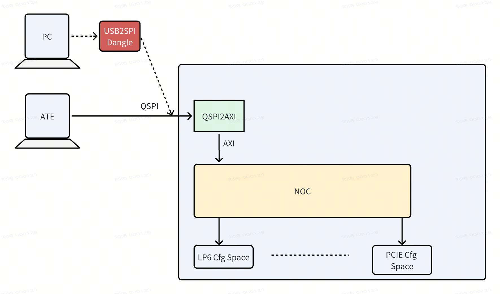
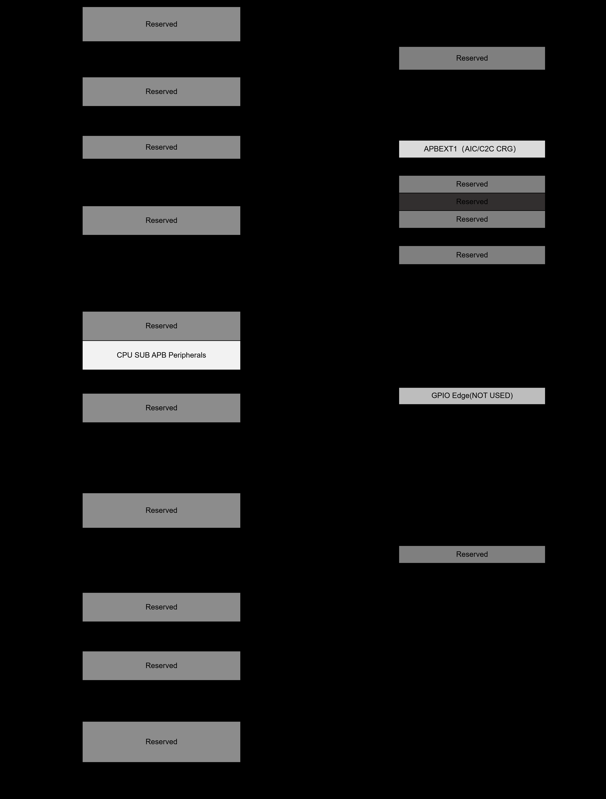
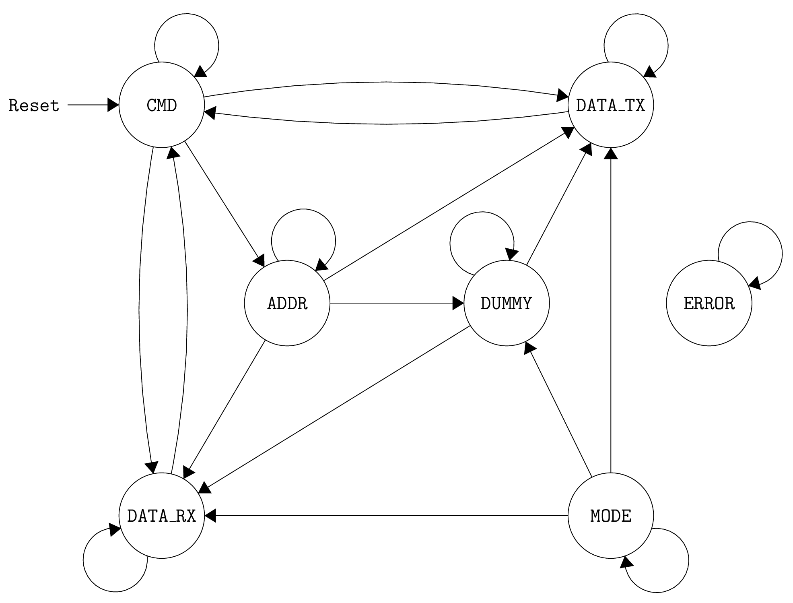
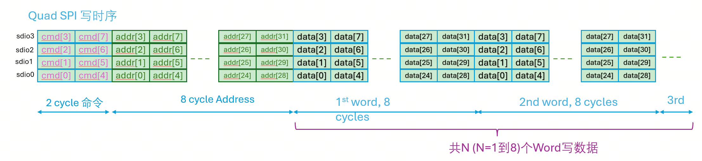
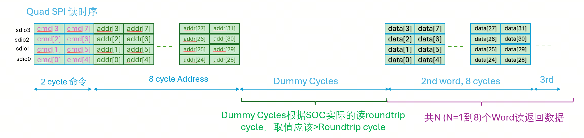

# SPI2AXI SPEC - Source Document
> 源文件: `SPI2AXI SPEC.pdf`  
> 总页数: 7  
> 提取日期: 2026-05-20  
---

## Page 1
### SPI2AXI SPEC
概述  
### SPI2AXI IP是一个将SPI从设备接口转换为AXI主设备接口的桥接模块，允许通过SPI总线访问AXI总线上的
存储器和外设。因为SPI是一个通用数字接口，SPI2AXI可以在桌面PC上使用，方便pattern的调试和实验  
室的bringup和debug。  
### IP主要特性
### SPI接口​：
•  
### 支持标准SPI和四线SPI两种工作模式。
◦  
SPI Slave 作为主动外设（active peripheral），无需 SoC 内部 CPU 干预即可完成SOC功能配  
置，状态观测等功能。  
◦  
AXI Lite 接口:  
•  
### 将 SPI 侧接收到的命令/数据转换成 AXI 事务。
◦  
通过 AXI Lite 接口访问 SoC 的内存和外设。  
◦  
​跨时钟域处理​：  
•  
### SPI时钟域与AXI时钟域分离。
◦  
内置 dual-clock FIFOs（双时钟 FIFO），实现从 SPI 时钟域 和SoC AXI 时钟域之间的可靠跨时钟  
### 域传输（CDC）。
◦  
接口定义  

*Page 1, Image Block 1 (png, 1770x1042, 104283 bytes)*

## Page 2
### SPI接口信号
信号名称  
方向  
描述  
spi_sclk  
输入  
SPI串行时钟,50Mhz  
spi_cs  
输入  
### SPI片选信号（低有效）
spi_sdi[3:0]  
输入  
### SPI数据输入线
spi_sdo[3:0]  
输出  
### SPI数据输出线
### AXI主设备接口
AXI4 Lite主设备接口，包括：  
### 写地址通道（AW）
•  
### 读地址通道（AR）
•  
### 写数据通道（W）
•  
### 读数据通道（R）
•  
### 写响应通道（B）
•  
操作流程  
写操作序列  
### 1. （可选）配置 SPI 参数（1线或者4线模式）
### 2. SPI主机发送写命令和地址
### 3. 控制器解析命令并同步到AXI时钟域
### 4. AXI桥接发起写地址事务
### 5. 通过FIFO传输写数据
### 6. 等待AXI写响应完成

## Page 3
读操作序列  
### 1. （可选）配置 SPI 参数（1线或者4线模式）
### 2. SPI主机发送读命令和地址
### 3. 控制器同步读请求到AXI时钟域
### 4. AXI桥接发起读地址事务
### 5. 从AXI总线读取数据到TX FIFO
### 6. 通过SPI接口返回读取的数据
可配置参数  
参数  
默认值  
描述  
### AXI_ADDR_WIDTH
32  
### AXI地址总线宽度
### AXI_DATA_WIDTH
32  
### AXI数据总线宽度
### AXI_ID_WIDTH
3  
### AXI ID信号宽度
### DUMMY_CYCLES
32  
SPI读操作虚拟周期数,实际Dummy_cycle=此处配置值+1  
应用场景  
系统调试和配置接口  
•  
低引脚数系统总线扩展  
•  
嵌入式系统固件更新  
•  
芯片测试和验证接口  
•  
这是一个SPI slave的实现版本。该 SPI 从机可被外部微控制器用于访问相关数据。 SPI 从机通过 AXI 总  
线来访问目标设备的配置空间和内存。 SoC配备了双时钟 FIFO 缓存器，用于实现从 SPI 频率域到 SoC  
### （AXI）频率域的时钟域转换。
在S3中，SPI2AXI 用于访问config 配置空间。地址范围如下图标注:  

*Page 3, Image Block 1 (png, 4136x5456, 185522 bytes)*

## Page 4
操作：  
要从内存/寄存器中读取和写入数据，需要采用以下方案。首先，主设备必须发送一个 8 位的操作码（如下  
所示）。如果要访问内存，则接下来必须跟随一个 32 位的地址（最高有效位在前）。寄存器的地址由操作  
码进行编码。在从内存读取数据的情况下，接下来必须插入 32(可编程) 个cycle已等待读数据返回。最后，  
实际数据将在最后的 32 位中传输（MSB first）。 该从属控制器基于下图所示的有限状态机:  

*Page 4, Image Block 1 (png, 4136x5456, 185522 bytes)*

*Page 4, Image Block 2 (png, 1971x1498, 80785 bytes)*

## Page 5
### SPI 命令操作码：
### SPI侧寄存器设定:

*Page 5, Image Block 1 (png, 1971x1498, 80785 bytes)*

*Page 5, Image Block 2 (png, 433x763, 88529 bytes)*

*Page 5, Image Block 3 (png, 785x382, 62001 bytes)*

## Page 6
### QSPI写时序：
### QSPI读时序：
Wrap操作支持  
SPI2AXI 模块支持 AXI4-Lite 协议。由于 AXI4-Lite 仅支持单次传输（single transfer），每个 burst 长  
度固定为 1，即  AxLEN = 0 ，且通常配置为  AxSIZE = 2 （表示每次传输 1 个 32-bit 字，即 4 字节）。  
SPI2AXI 引入了 可配置的地址 Wrap 功能：  
Wrap = 0, 无环绕功能  
•  
Wrap = N （N > 0）：启用地址环绕模式，环绕窗口大小为 N 个字（word），即 4×N 字节。  
起始地址必须按 4 字节对齐（因  AxSIZE=2 ）。  
地址从起始地址开始，每次传输后地址 +4（下一个 word），当访问完第 N 个 word 后，自动回  
绕到起始地址。  
•  

*Page 6, Image Block 1 (png, 785x382, 62001 bytes)*

*Page 6, Image Block 2 (png, 2213x511, 137559 bytes)*

*Page 6, Image Block 3 (png, 2291x544, 133922 bytes)*

## Page 7
✅ 示例：  
若  Wrap = 2 ，起始地址为  'h100 （4-byte 对齐），则连续写操作的地址序列为：  
Burst 0: Write to  'h100  （第 1 个 word）  
•  
Burst 1: Write to  'h104  （第 2 个 word）  
•  
Burst 2: Write to  'h100  （回绕，重新从第 1 个 word 开始）  
•  
Burst 3: Write to  'h104  
•  
Burst 4: Write to  'h100  
•  
