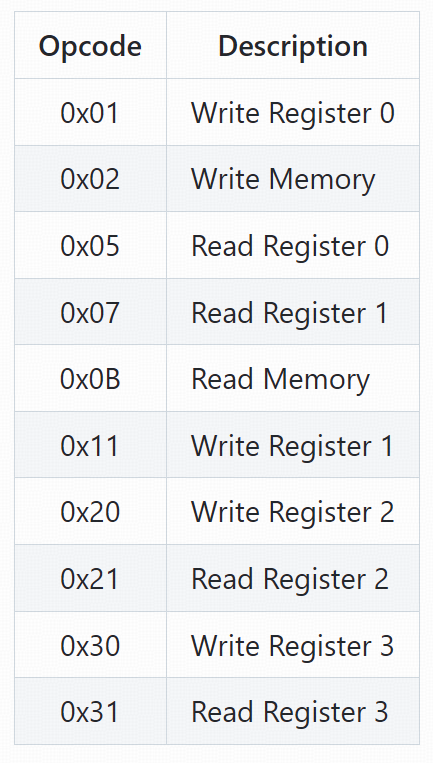
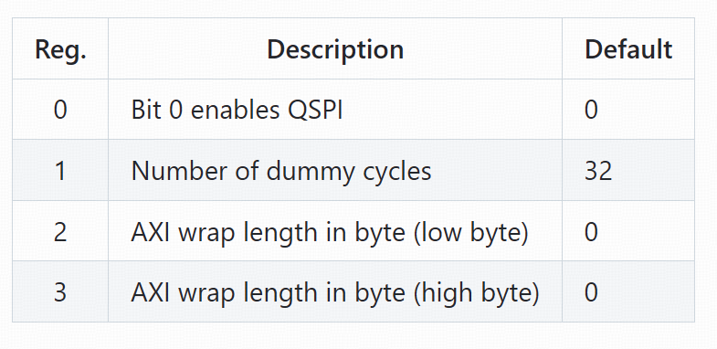

# 配置寄存器 (Configuration Registers)

## SPI 命令操作码

<!-- Page 5: SPI command opcode table mapping opcodes to operations (READ, WRITE, REG_READ, REG_WRITE) -->

## SPI 侧寄存器设定

<!-- Page 5: SPI-side register configuration table with address mapping and field definitions -->

<!-- Page 5: SPI-side register configuration continued - control and status register fields -->

## 寄存器概述

SPI侧的寄存器由操作码(opcode)进行地址编码。主要寄存器类型包括:

- **控制寄存器**: SPI工作模式选择(1线/4线)
- **状态寄存器**: 反映当前FIFO状态、传输状态
- **Wrap配置寄存器**: 配置地址环绕功能参数
- **操作码编码**: 支持READ/WRITE/REG_READ/REG_WRITE等操作
